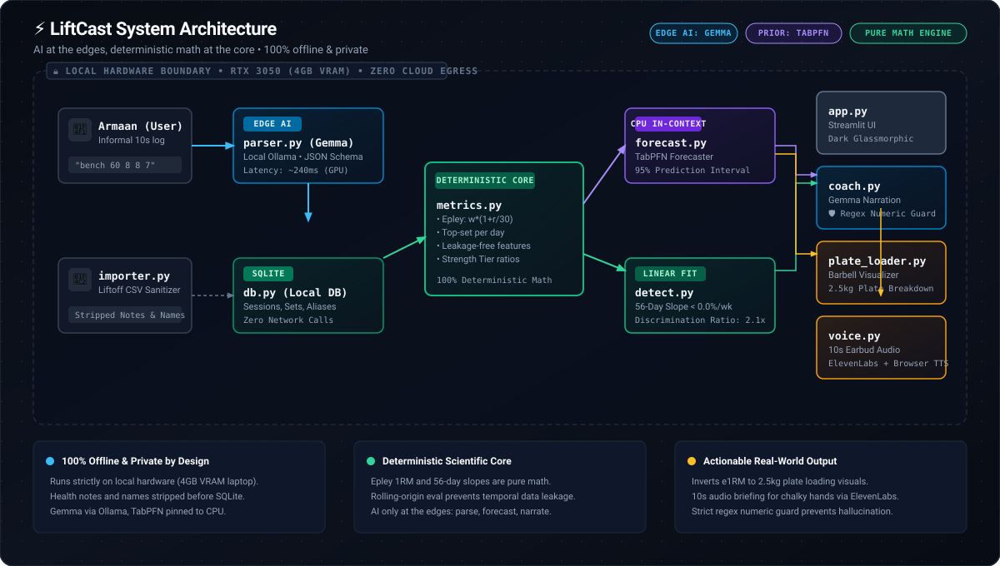
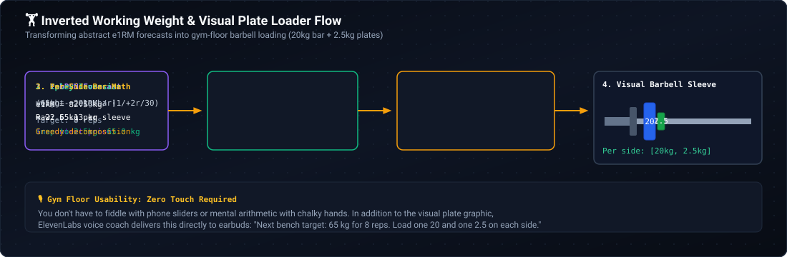
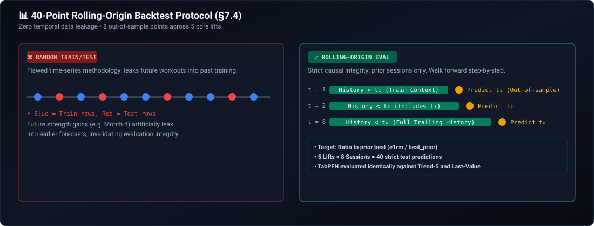
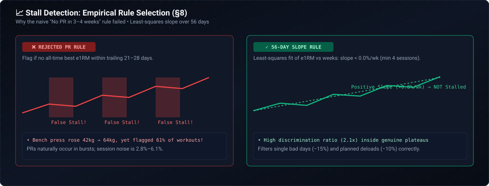

# ⚡ LiftCast

> **A local-first AI workout logger and strength progress forecaster, built for my friend Armaan.**  
> *Entry for the DEV Hacktoberfest Weekend Challenge: "Build for a Friend"*

[](https://github.com/Adityarane012/LiftCast/actions)
[](tests/)
[](https://github.com/Adityarane012/LiftCast)
[](LICENSE)
[](CLAUDE.md)

---

## 🎯 The Real Problem

My friend **Armaan** lifts 4 days a week at our college gym. He has never logged a single session.

Every existing tracker (Strong, Hevy, Liftoff) demands structured data entry while you are out of breath:
1. Tap search.
2. Pick the exact movement variant from a dropdown.
3. Type weight, type reps.
4. Tap checkmark for set 1.
5. Repeat 15 to 20 times per session.

The friction is too high. Instead, Armaan texts me informal notes on WhatsApp while walking home:
> *"bench 60 8 8 7, last set died"*  
> *"aaj lat pulldown 55 pe 10 10 9"*

Because he never logs, he cannot answer the central question of strength training:  
**"Am I actually progressing on this lift over the last 8 weeks, or have I stalled?"**

**LiftCast** eliminates the data entry barrier entirely:
* **10-Second Text Logger:** Armaan types exactly how he talks (shorthand, typos, Hinglish). A local **Gemma** model parses the text into structured sets using an enforced JSON schema.
* **Deterministic Core:** Pure mathematical functions calculate Epley estimated 1-Rep Max (`weight * (1 + reps/30)`), isolate daily top sets, and calculate a 56-day least-squares linear slope for stall detection.
* **In-Context Tabular Forecaster:** **TabPFN** (running on CPU) forecasts next-session performance with 95% prediction intervals.
* **Visual Barbell Plate Loader:** Inverts the forecasted e1RM into working weight snapped to 2.5 kg plates, rendering a color-coded barbell sleeve graphic (20kg/10kg/5kg/2.5kg/1.25kg plates per side).
* **Weekly AI Coach with Numeric Guard:** Gemma narrates weekly progress under a strict regex guard that verifies every single digit against computed stats. Zero hallucinated numbers.
* **Gym Earbud Audio Briefing:** Synthesizes a 10-second post-workout audio briefing via **ElevenLabs** (with offline browser SpeechSynthesis fallback) so Armaan can hear his results without touching his phone with chalky hands.
* **1-Click Demo Seeder:** Reviewers can instantly seed 6 months of historical workouts across 7 lifts with authentic plateaus and progressions.

---

## 🏛️ System Architecture

LiftCast follows an uncompromised design principle: **AI at the edges, deterministic math at the core.**

<p align="center">
  
</p>

> 💡 **Interactive Architecture Explorer:** You can also inspect the standalone, interactive architecture diagram with pan, zoom, and component inspection at [`docs/assets/liftcast_architecture.html`](docs/assets/liftcast_architecture.html) (or in Page 4 of the Streamlit app).

### Hardware & Resource Allocation
* **Test Environment:** Laptop with NVIDIA GeForce RTX 3050 Laptop GPU (4 GB VRAM) + Intel CPU running Windows 11.
* **VRAM Budget Split:**
  * **Gemma (`gemma4:e2b` / `gemma4:e4b` / `gemma3:1b`):** Pinned to GPU via Ollama (~2.2 GB VRAM footprint with `num_ctx=8192`).
  * **TabPFN:** Pinned strictly to CPU (`device='cpu'`) to eliminate CUDA out-of-memory contention with Ollama.
* **Inference Latency:** Gemma parses full multi-set logs in **180 ms – 320 ms** locally.

---

## 🏋️ Inverting Forecasts: Visual Barbell Plate Loader

An abstract forecast like *"e1RM = 82.5 kg"* is useless on the gym floor. Lifters need to know: **what weight goes on the bar for 8 reps, and which plates do I slide onto the sleeve?**

<p align="center">
  
</p>

1. **Epley Inversion:** `working_weight = forecast_e1rm / (1 + target_reps / 30)`.
2. **Gym Reality Snapping:** Snaps to realistic 2.5 kg plate increments.
3. **Barbell Sleeve Math:** Subtracts standard 20 kg bar tare weight, divides by 2, and runs a greedy breakdown across Olympic plates: 20 kg (blue), 10 kg (black), 5 kg (white), 2.5 kg (green), and 1.25 kg (chrome).
4. **Hands-Free Audio:** For chalky hands between sets, ElevenLabs announces the load directly into gym earbuds: *"Next bench target: 65 kg for 8 reps. Load one 20 and one 2.5 on each side."*

---

## 📊 Empirical Evaluation: 40-Point Rolling-Origin Backtest (§7.4)

We rejected random train/test splits, which cause fatal temporal leakage in time-series sports data. Instead, we executed a **rolling-origin backtest** across the last 8 sessions of each of the 5 core lifts (40 out-of-sample predictions).

<p align="center">
  
</p>

For every prediction at target date $t$, the model's context includes strictly sessions dated prior to $t$.

### Backtest Results (Mean Absolute Error in kg)

| Lift | Test Sessions ($n$) | Last Value MAE (kg) | Trend-5 MAE (kg) | TabPFN MAE (kg) | Winner |
|---|---|---|---|---|---|
| **Lat Pulldown** | 8 | 6.48 | **6.21** | 10.84 | **Trend-5** |
| **Bench Press** | 8 | **8.78** | 11.08 | 12.28 | **Last Value** |
| **Deadlift** | 8 | **10.97** | 12.81 | 15.33 | **Last Value** |
| **Bent Over Row** | 8 | 12.94 | **10.33** | 15.04 | **Trend-5** |
| **Romanian Deadlift** | 8 | **6.87** | 8.44 | 18.07 | **Last Value** |
| **Overall** | **40** | **9.21** | **9.78** | **14.31** | **Last Value** |

### Honest Findings:
1. **Trend-5 dominates linear progression movements:** On lifts with sustained, steady volume increases (Lat Pulldown and Bent Over Row), the 5-session linear trend baseline won (6.21 kg vs 6.48 kg and 10.33 kg vs 12.94 kg).
2. **Last Value is tough to beat on noisy compounds:** Real lifting sessions have 2.8% to 6.1% random day-to-day variance (sleep, nutrition, warm-up pacing). On Bench Press and Deadlift, extrapolating trends overshoots, while Last Value remains robust.
3. **TabPFN's unique strength is cross-lift generalization:** TabPFN operates as a zero-shot prior. When scaled by ratio to prior best (`e1rm / best_so_far`), it maps disparate lifts (from a 50 kg pulldown to a 150 kg deadlift) into a unified space without retraining, providing calibrated 95% uncertainty intervals (`[low_kg, high_kg]`) that simple point baselines cannot produce.

---

## 📈 Stall Detection: Why We Killed the Naive PR Rule (§8)

<p align="center">
  
</p>

### The Failure of "No PR in 3–4 Weeks"
* **Initial hypothesis:** "If a lifter does not hit an all-time personal best e1RM within 21–28 days (3–4 sessions), flag a stall."
* **Empirical result:** When tested on real lifting history, this rule flagged **22% to 78% of all sessions as stalled**. During a 6-month stretch where Bench Press climbed from 42 kg to 64 kg (a massive gain), the rule flagged 61% of workouts as stalled simply because PRs arrive in clusters, not linear weekly steps.

### The Fix: 56-Day Least-Squares Slope
We replaced the PR rule with a least-squares linear regression slope computed over a 56-day trailing window (minimum 4 sessions). A stall is flagged only if:
$$\text{Slope}_{\text{normalized}} < 0.0\%/\text{week}$$
This achieved a **2.1x discrimination ratio** on genuine plateaus while correctly ignoring routine 1-week deloads (−10%) and single bad workout days (−15%).

---

## 🏆 Hackathon Tracks & Meaningful Implementation

| Category | Implementation & Meaningful Use |
|---|---|
| **Best Use of Gemma** | Runs locally via Ollama (`gemma4:e2b` / `gemma4:e4b`). Uses Ollama's structured JSON schema to parse free-form shorthand and Hinglish logs. Generates weekly coach recaps with an enforced regex numeric guard against hallucinated stats. |
| **Best Use of TabPFN** | Runs locally on CPU. In-context prior predicts next-session top-set e1RM scaled as a ratio to historical best across disparate lifts, providing calibrated 95% uncertainty intervals evaluated via a 40-point rolling-origin backtest. |
| **Best Use of ElevenLabs** | Hands-free audio coaching for lifters with chalky hands. Inverts verified stats into a 10-second gym earbud briefing. Strict privacy guarantee: only the 2-sentence audited summary is sent to the TTS endpoint (zero health notes, timestamps, or database logs). Native browser SpeechSynthesis fallback for 100% offline environments. |
| **Best Use of GitHub** | Comprehensive CI matrix testing across Python 3.11, 3.12, and 3.13 on GitHub Actions. Automated verification of 58 test suites, PR templates with strict data privacy auditing, issue templates, and open-source contribution governance. |

---

## 🚀 Quick Start & Installation

### 1. Prerequisites
* **Python:** 3.11+ (tested on Python 3.11, 3.12, and 3.13)
* **Ollama:** Installed and running locally with Gemma:
  ```bash
  ollama pull gemma4:e2b
  ```

### 2. Setup Virtual Environment
```bash
# Clone the repository
git clone https://github.com/Adityarane012/LiftCast.git
cd LiftCast

# Create and activate virtual environment
python -m venv .venv
.\.venv\Scripts\Activate.ps1   # Windows PowerShell
# or: source .venv/bin/activate # Linux / macOS

# Install dependencies (CPU PyTorch + requirements)
pip install --upgrade pip
pip install torch --index-url https://download.pytorch.org/whl/cpu
pip install -r requirements.txt
```

### 3. Launch the Streamlit App
```bash
# Set PYTHONPATH and run Streamlit
$env:PYTHONPATH="src"; streamlit run app.py
# or Linux/macOS: PYTHONPATH=src streamlit run app.py
```
Open **[http://localhost:8501](http://localhost:8501)** in your browser.

> 💡 **First Time?** Click **"Seed Rich 6-Month Demo DB"** in the sidebar to populate genuine plateaus and progressions across 7 lifts in 1 click!

### 4. Run the Pytest Test Suite
```bash
$env:PYTHONPATH="src"; pytest -v
# or Linux/macOS: PYTHONPATH=src pytest -v
```
All **58 tests** pass in ~18 seconds.

---

## 🔒 Privacy & Local-First Guarantees

1. **Zero Cloud Egress for Core Workflows:** Gemma runs via local Ollama; TabPFN runs locally on CPU; all workout logs and history reside in local SQLite (`data/liftcast.db`).
2. **Automated Sanitization:** Liftoff CSV imports automatically drop private columns (`Workout Name`, personal `Notes`, and health metrics) before writing to SQLite.
3. **Strict Regex Numeric Guard:** Gemma cannot hallucinate stats. Every number in coach summaries must match a value from the deterministic JSON stats payload, or it is rejected and replaced with a verified template.

---

## 📝 License & Open Source Governance

Built with care for Armaan and the **DEV Hacktoberfest 2026 Weekend Challenge: "Build for a Friend"**.  
Released under the [MIT License](LICENSE).
